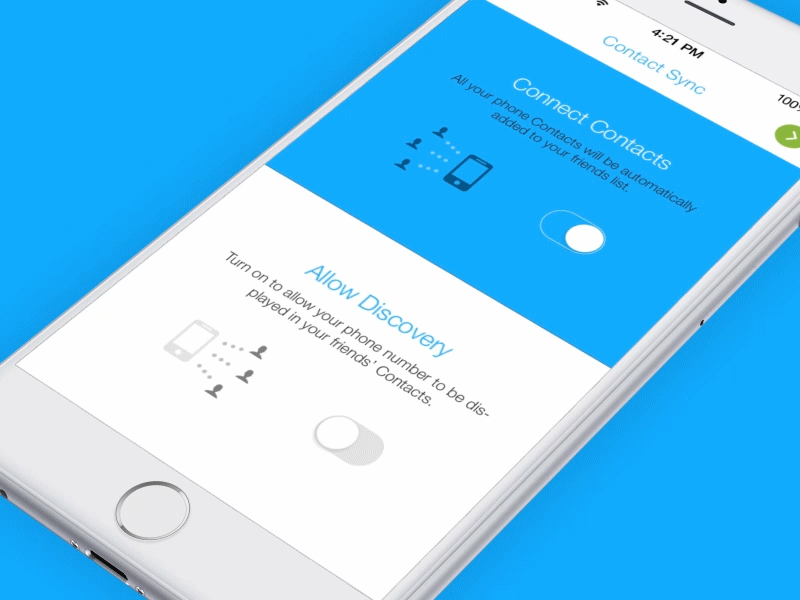

# Paper Switch Objective C
 RAMPaperSwitch is a Swift module which paints over the parent view when the switch is turned on. Objecrive C Version

I have just use paper switch Swift animation file in Objective C code.

[Paper Switch by Ramotion](https://github.com/Ramotion/paper-switch)

#Screenshot

## Requirements

- iOS 8.0+
- Xcode 6.1
	

